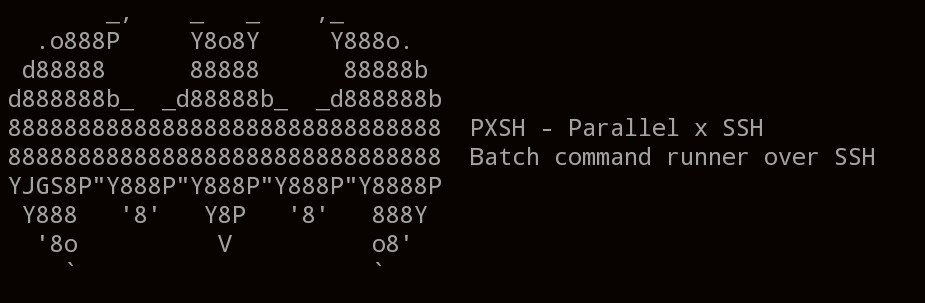

**pxsh** is a minimalist CLI tool to run shell commands on multiple remote servers over SSH. It supports complex commands (`|`, `&&`, `;`) and provides quick server availability checks.

---

## 🚀 Features

- Secure remote command execution via SSH
- Supports multi-host targets (comma-separated)
- Handles complex bash syntax
- Server activity check with `--active`

---

## installation 
for quick install 

```bash
pip3 install .
```

## ⚙️ Usage

### Run command on multiple servers
```bash
pxsh --server user@host1,user@host2 --send "uptime && whoami"
```
Check if servers are online
```bash
pxsh --server user@host1,user@host2 --active
```

---

🛡 Security

Commands are sent only to remote hosts — never run locally. SSH handles execution securely.


💌 Have Fun
